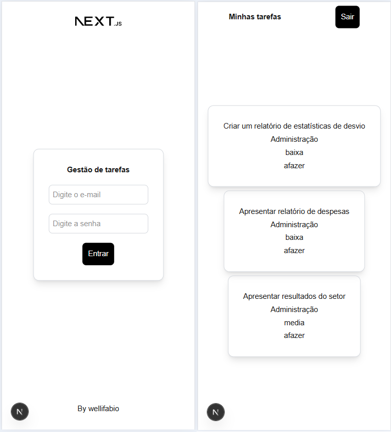

# Tarefas - Next.js

Aplicativo simples de gestão de tarefas a fazer, com exemplos de controle de acesso, criptografia, CRUD completo.
Desenvolvido com Next.js e Prisma.

## Tecnologias
- VsCode
- Node.js
- Next.js
- Prisma
- Git
- XAMPP (MysQL - MariaDB)

## Passos para executar localmente
- 1 Clone este repositório, abra com o **VsCode**, crie o arquivo `.env` contendo a string de conexão com MySQL/MariaDB
```env
DATABASE_URL="mysql://root@localhost:3306/tarefas"
```
- 2 Abra o painel de controle do **XAMPP** e de start em MySQL
- 3 Em um terminal `bash` ou `cmd` instale as dependências, migrue o banco de dados e execute o projeto
```bash
npm install
npx prisma migrate dev --name init 
npm run dev
```
- 4 Abra [http://localhost:3000](http://localhost:3000) with your browser to see the result.

## Screenshot
